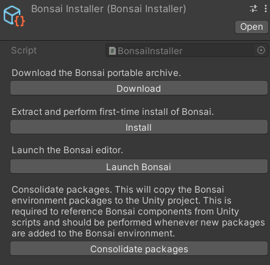
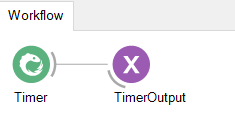
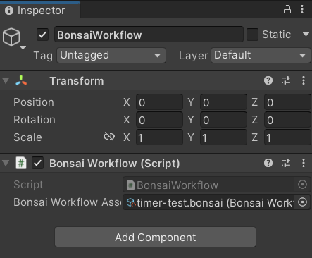

# unity
A Bonsai interface for the Unity real-time development platform

# Introduction
This repository contains a Unity package and minimal sample project to allow the Unity engine to interface with Bonsai workflows. This interface can be used to pass data between Unity and Bonsai at runtime and harness Bonsai reactive workflows to perform image processing tasks, integrate Arduino devices, perform machine-learning tasks etc.

# Installation
To install the interface, download the 'bonsai-interface' Unity package from this repository and open it in a new Unity project (Assets >> Import Package >> Custom Package), importing everything in the Bonsai and Packages folders. This will import the core Bonsai interface components and some required libraries.

Once the import has completed, navigate to the Bonsai folder in Assets and locate the 'BonsaiInstaller' asset. Click on the asset and follow the steps in the custom inspector dialog in order.



- **Download** will download a portable archive of the Bonsai exectuable in the root project folder.
- **Install** performs first time setup of the Bonsai environment in Unity and open the Bonsai editor. Close the Bonsai editor after this step to complete installation.
- **Launch Bonsai** will reopen the Bonsai editor.
- **Consolidate packages** ensures that the required libraries for running a Bonsai process from a Unity instance are copied from the Bonsai environment. This step should be performed after importing any new packages in the Bonsai editor.

# Quick start

As a quick minimal example, we'll create a Bonsai workflow with a periodic timer that emits events every second, and then log those events to the Debug window in Unity.

Click **Launch Bonsai** and create a new Bonsai project. Add a timer node with a period of 1s. Connect the timer to a PublishSubject node and give it a name like 'TimerOutput'. Save the workflow in the assets folder of your Unity project (as e.g. timer-test.bonsai).



 In the Unity editor, locate the Bonsai menu (located with File, Edit etc.) and select 'Create Bonsai workflow asset' and then open the created .bonsai workflow in the assets folder. This will convert the .bonsai file into a scriptable object that can be dragged into the Unity inspector later.

 Create a new empty game object in the Unity scene hierarchy and add the 'BonsaiWorkflow' component. In the 'BonsaiWorkflowAsset' field drag in the newly created scriptable object from assets.

 

 Create a new script called 'WorkflowMonitor' on the same empty game object and add the code:

```
using UnityEngine;
using Bonsai.Expressions;

public class WorkflowMonitor : MonoBehaviour
{
    [HideInInspector]
    public BonsaiWorkflow workflow;

    // Start is called before the first frame update
    void Start()
    {
        workflow = GetComponent<BonsaiWorkflow>();

        workflow.InjectSubscription("TimerOutput", 
                                    typeof(PublishSubjectBuilder), 
                                    (u) => { Debug.Log(u); });
    }
}
```

Hit play in the Unity editor and you should see the timer output logged to the Console.